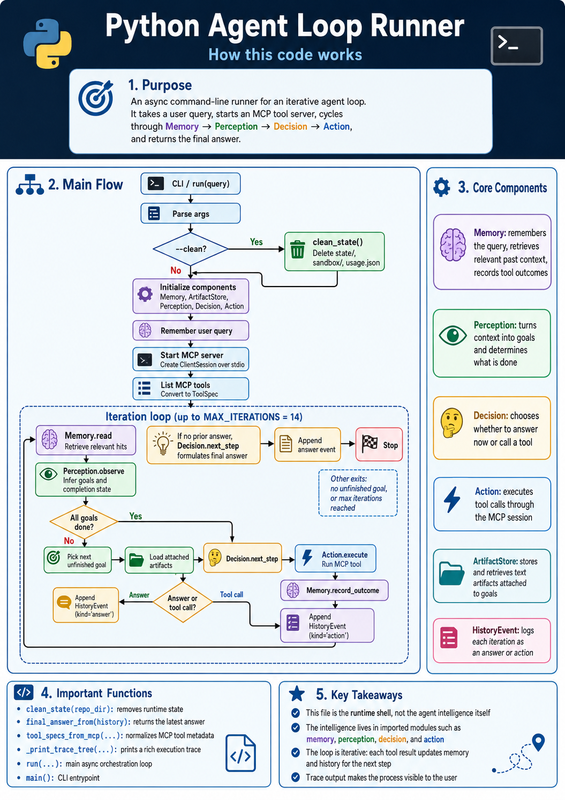
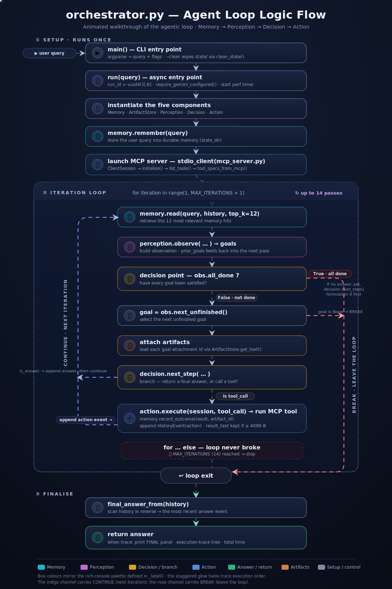

# EAG3 Session 6 Agent Architecture Assignment

This repository implements the Session 6 role-based agent architecture:

- `memory.py` — durable JSON memory under `state/memory.json`
- `perception.py` — Gemini-backed goal decomposition, verification and artifact attachment
- `decision.py` — Gemini-backed one-goal-at-a-time answer-or-tool selection
- `action.py` — pure MCP dispatch and artifact storage
- `llm.py` — direct Gemini Flash-Lite structured-output helper
- `schemas.py` — Pydantic v2 contracts at every role boundary
- `orchestrator.py` — the orchestration loop
- `mcp_server.py` — stdio MCP server from the session notes

## Architecture Overview





## Important note about LLM calls

This build intentionally does **not** use LLM Gateway V3. The working instruction for this version is: **"The LLM Gateway is NOT required, ignore it."**

Perception and Decision are real LLM-backed layers using direct Gemini API calls to `gemini-3.1-flash-lite` with JSON structured output validated by the existing Pydantic contracts. The implementation still preserves:

- typed Pydantic contracts between roles,
- four separated cognitive layers,
- durable memory,
- artifact handling,
- MCP stdio tool dispatch,
- a loop that verifies goal completion through Perception.

## Setup

Install dependencies with `uv`:

```bash
uv sync
uv run playwright install chromium
```

Create `.env` with a Gemini API key. Tavily is optional:

```bash
cp .env.example .env  # optional if you create this file locally
# then add:
# GEMINI_API_KEY=...
# TAVILY_API_KEY=...
```

`GEMINI_API_KEY` is required for the Perception and Decision LLM calls. `web_search` uses Tavily when `TAVILY_API_KEY` is present and falls back to DuckDuckGo through `ddgs` otherwise. `fetch_url` uses `crawl4ai` and requires the Playwright Chromium runtime.

## Cleaning state

The assignment requires the state directory to be cleanable. Use:

```bash
./scripts/clean_state.sh
```

or run any query with `--clean`:

```bash
uv run python orchestrator.py --clean "When is mom's birthday?"
```

The following paths are intentionally ignored by git:

- `state/`
- `sandbox/`
- `usage.json`
- `.env`

## Target queries

### Query A — Claude Shannon artifact attach test

```bash
uv run python orchestrator.py --clean "Fetch https://en.wikipedia.org/wiki/Claude_Shannon and tell me his birth date, death date, and three key contributions to information theory."
```

Expected final answer shape:

```text
Birth date: April 30, 1916.
Death date: February 24, 2001.
Three key contributions to information theory:
1. He founded the mathematical theory of communication through his 1948 paper 'A Mathematical Theory of Communication'.
2. He formalized the bit as a unit of information and connected information content with entropy.
3. He established the noisy-channel coding theorem and the Shannon limit, showing the maximum reliable communication rate over a noisy channel.
```

Expected loop behavior: fetch page, store large fetch as an artifact, attach artifact to extraction goal, answer, verify done. Usually 3 iterations.

### Query B — Tokyo activities with weather constraint

```bash
uv run python orchestrator.py --clean "Find 3 family-friendly things to do in Tokyo this weekend. Check Saturday's weather forecast there and tell me which one is most appropriate."
```

Expected final answer shape:

```text
Three family-friendly Tokyo options are:
1. <activity>
2. <activity>
3. <activity>

Saturday weather: <forecast summary>. The most appropriate choice is <indoor/weather-safe activity>, because it keeps the family indoors or mostly weather-protected while still being engaging for children.
```

Expected loop behavior: search activities, fetch Tokyo weather, select the most weather-appropriate activity, verify done. Usually 4 to 6 iterations depending on network results.

### Query C — durable memory across two runs

Run 1:

```bash
uv run python orchestrator.py --clean "My mom's birthday is 15 May 2026. Remember that and give me a calendar reminder for two weeks before and on the day."
```

Expected final answer:

```text
Mom's birthday on 15 May 2026 is recorded, with reminders created for two weeks before and on the day.
```

Run 2, without cleaning state:

```bash
uv run python orchestrator.py "When is mom's birthday?"
```

Expected final answer:

```text
Mom's birthday is on 15 May 2026.
```

Expected loop behavior: run 1 stores a durable `fact` in `state/memory.json` and creates two sandbox reminder files. Run 2 answers from durable memory.

### Query D — asyncio multi-source synthesis

```bash
uv run python orchestrator.py --clean "Search for 'Python asyncio best practices', read the top 3 results, and give me a short numbered list of the advice they agree on."
```

Expected final answer shape:

```text
1. Use asyncio.run() as the single top-level entry point for async programs instead of manually managing the event loop.
2. Run independent coroutines concurrently with asyncio.gather() or TaskGroup rather than awaiting them one by one.
3. Do not block the event loop; move blocking I/O or CPU-heavy work into threads/processes with helpers such as asyncio.to_thread().
4. Put timeouts around external calls so one slow network operation does not hang the whole workflow.
5. Limit fan-out with semaphores or bounded queues when calling rate-limited services.
```

Expected loop behavior: search top 3 results, fetch each result, store large pages as artifacts, attach artifacts to synthesis goal, answer, verify done. Usually 6 iterations.

## Tests

Unit tests cover pure logic across all modules (schemas, memory, decision, action, mcp_server sandbox):

```bash
uv run pytest          # 57 tests, ~1s
uv run pytest -v       # verbose output
```

## Run all four checks

```bash
./scripts/run_all.sh
```

## Perception and Decision prompts plus validation JSON

The required proof-of-process files are in `prompt_validation/`:

- `prompt_validation/perception_prompt.md`
- `prompt_validation/decision_prompt.md`
- `prompt_validation/validation_examples.json`

## Actual terminal output

```
uv run python orchestrator.py --clean "Fetch https://en.wikipedia.org/wiki/Claude_Shannon and tell me his birth date, death date, and three key contributions to information theory."

[05/17/26 18:56:15] INFO     Processing request of type ListToolsRequest                                                       server.py:727

────────────────────────────────────────────────────────────────── iter 1 ──────────────────────────────────────────────────────────────────
🧠 memory.read 0 hit(s) (0.00s)
👁️ perception ○ Fetch https://en.wikipedia.org/wiki/Claude_Shannon (26.60s)
👁️ perception ○ Extract birth date, death date, and three key contributions to information theory from the fetched content
🤔 decision TOOL_CALL: fetch_url({'url': 'https://en.wikipedia.org/wiki/Claude_Shannon'}) (0.97s)
[05/17/26 18:56:43] INFO     Processing request of type CallToolRequest                                                        server.py:727
[INIT].... → Crawl4AI 0.8.6 
[FETCH]... ↓ https://en.wikipedia.org/wiki/Claude_Shannon                                                         | ✓ | ⏱: 1.48s 
[SCRAPE].. ◆ https://en.wikipedia.org/wiki/Claude_Shannon                                                         | ✓ | ⏱: 0.22s 
[COMPLETE] ● https://en.wikipedia.org/wiki/Claude_Shannon                                                         | ✓ | ⏱: 1.72s 
⚡ action ok: [artifact art:9ffe12b52cac72dc, 260981 bytes] preview: {   "status": 200,   "content_type": "text/markdown",   "length_bytes":
255130,   "text": "[Jump to content](https://en.wikipedia.org/wiki/Claude_Shannon#bodyContent)\nMain menu\nMain menu\nmove to sidebar 
hide\nNavigation \n  * [Main page](https://en.wikipedia.org/wiki/Main_Page \"Visit the main page \\[z\\]\")\n  * 
[Contents](https://en.wikipedia.org/wiki/Wikipedia:Contents \"Guides to browsing Wikipedia\")\n  * [Current 
events](https://en.wikipedia.org/wiki/Portal:Current_events \"Articles related to current events\")\n  * [Random 
article](https://en.wikipedia.org/wiki/Special:Random \"Visit a randomly selected article \\[x\\]\")\n  * (3.33s)
⏱️  iter 1 total: 30.91s

────────────────────────────────────────────────────────────────── iter 2 ──────────────────────────────────────────────────────────────────
🧠 memory.read 1 hit(s) (0.00s)
👁️ perception ✓ Fetch https://en.wikipedia.org/wiki/Claude_Shannon (2.30s)
👁️ perception ○ Extract birth date, death date, and three key contributions to information theory from the fetched content 
attach=['art:9ffe12b52cac72dc']
📎 art:9ffe12b52cac72dc (260981 bytes)
🤔 decision ANSWER: Claude Shannon was born on April 30, 1916, and died on February 24, 2001. Three of his key contributions to information 
theory include: 1) The development of information entropy as a measure of information content and uncertainty; 2) The establishment of the 
field of information theory through his 1948 paper 'A Mathematical Theory of Communication'; and 3) The introduction of the 'bit' as a unit 
of information, alongside the Nyquist-Shannon sampling theorem which enabled the transition from anal (2.45s)
⏱️  iter 2 total: 4.76s

────────────────────────────────────────────────────────────────── iter 3 ──────────────────────────────────────────────────────────────────
🧠 memory.read 1 hit(s) (0.00s)
👁️ perception ✓ Fetch https://en.wikipedia.org/wiki/Claude_Shannon (18.92s)
👁️ perception ✓ Extract birth date, death date, and three key contributions to information theory from the fetched content 
attach=['art:9ffe12b52cac72dc']
⏱️  iter 3 total: 18.92s
✅ all goals satisfied

╭──────────────────────────────────────────────────────────────── ✨ FINAL ────────────────────────────────────────────────────────────────╮
│ Claude Shannon was born on April 30, 1916, and died on February 24, 2001. Three of his key contributions to information theory include:  │
│ 1) The development of information entropy as a measure of information content and uncertainty; 2) The establishment of the field of      │
│ information theory through his 1948 paper 'A Mathematical Theory of Communication'; and 3) The introduction of the 'bit' as a unit of    │
│ information, alongside the Nyquist-Shannon sampling theorem which enabled the transition from analog to digital telecommunications.      │
╰──────────────────────────────────────────────────────────────────────────────────────────────────────────────────────────────────────────╯
🔄 Execution Trace (2 iterations · 1 tool call(s) · 55.0s total)
├── Iter 1 · Fetch https://en.wikipedia.org/wiki/Claude_Shannon
│   └── 🧠 Memory → 👁️ Perception → 🤔 Decision → ⚡ Action(fetch_url) ✓
└── Iter 2 · Extract birth date, death date, and three key contributions …
    └── 🧠 Memory → 👁️ Perception → 🤔 Decision → 💡 Answer ✓
⏱️  total: 54.98s
💰 LLM Usage: 5 calls · 106,164 prompt + 633 completion = 106,797 total tokens · ~$0.0275


uv run python orchestrator.py --clean "Find 3 family-friendly things to do in Tokyo this weekend. Check Saturday's weather forecast there and tell me which one is most appropriate."

[05/17/26 18:58:16] INFO     Processing request of type ListToolsRequest                                                       server.py:727

────────────────────────────────────────────────────────────────── iter 1 ──────────────────────────────────────────────────────────────────
🧠 memory.read 0 hit(s) (0.00s)
👁️ perception ○ Find 3 family-friendly activities in Tokyo (19.16s)
👁️ perception ○ Get the weather forecast for Tokyo for this Saturday
👁️ perception ○ Choose the most appropriate family-friendly activity based on the weather forecast
🤔 decision TOOL_CALL: web_search({'query': 'family-friendly activities Tokyo this weekend weather Saturday Tokyo'}) (17.26s)
[05/17/26 18:58:52] INFO     Processing request of type CallToolRequest                                                        server.py:727
⚡ action ok: [artifact art:fbee8e76e07bcc57, 10661 bytes] preview: {   "title": "The best Tokyo Family-friendly activities 2026 - Free 
cancellation",   "url": "https://www.getyourguide.com/tokyo-l193/family-friendly-activities-tc1094/",   "snippet": "Image 2: image Top pick 
Tokyo: Mt Fuji & Oishi Park & Lake Kawaguchi & Oshino Hakkai 10 hours • Private option available • Pickup available 4.8(1,658) From $82 
$49Image 3: image #1 selling guided tour Tokyo: Shinjuku Sumo Show & Experience with Photo 1.5 hours 4.8(1,650) From $76 $61Image 4: image 
Booked 33 times yesterday Tokyo: Sumo Entertainment Show with Chicken Hot Pot & Geisha 2 hours 4.8(7,333) From $101Image 5: image Booked 41 
times yesterday Mt Fuji (3.30s)
⏱️  iter 1 total: 39.72s

────────────────────────────────────────────────────────────────── iter 2 ──────────────────────────────────────────────────────────────────
🧠 memory.read 1 hit(s) (0.00s)
👁️ perception ✓ Find 3 family-friendly activities in Tokyo (1.51s)
👁️ perception ○ Get the weather forecast for Tokyo for this Saturday
👁️ perception ○ Choose the most appropriate family-friendly activity based on the weather forecast attach=['art:fbee8e76e07bcc57']
🤔 decision TOOL_CALL: web_search({'query': 'weather forecast Tokyo Saturday May 23 2026'}) (19.58s)
[05/17/26 18:59:17] INFO     Processing request of type CallToolRequest                                                        server.py:727
⚡ action ok: [artifact art:066f78753badf16e, 9660 bytes] preview: {   "title": "Tokyo weather in May 2026 - Weather25.com",   "url": 
"https://www.weather25.com/asia/japan/tokyo?page=month&month=May",   "snippet": "4.5 mm\n\n20° / 16°Friday\n\nMay 22\n\nOvercast\n\n8.5 
mm\n\n20° / 14°Saturday\n\nMay 23\n\nPatchy rain possible\n\n0 mm\n\n23° / 19°Sunday\n\nMay 24\n\nLight rain\n\n4 mm\n\n21° / 
20°Monday\n\nMay 25\n\nLight drizzle\n\n1.8 mm\n\n22° / 19°Tuesday\n\nMay 26\n\nLight rain shower\n\n2.3 mm\n\n22° / 20° Next  \nMonth 
>>\n\n## The average weather in Tokyo in May\n\nThe temperatures in Tokyo in May are comfortable with low of 16°C and and high up to 
23°C.\n\nYou can expect rain for roughly half of t (3.37s)
⏱️  iter 2 total: 24.47s

────────────────────────────────────────────────────────────────── iter 3 ──────────────────────────────────────────────────────────────────
🧠 memory.read 2 hit(s) (0.00s)
👁️ perception ✓ Find 3 family-friendly activities in Tokyo (16.57s)
👁️ perception ✓ Get the weather forecast for Tokyo for this Saturday
👁️ perception ○ Choose the most appropriate family-friendly activity based on the weather forecast attach=['art:fbee8e76e07bcc57', 
'art:066f78753badf16e']
📎 art:fbee8e76e07bcc57 (10661 bytes)
📎 art:066f78753badf16e (9660 bytes)
🤔 decision ANSWER: For this Saturday, May 23, 2026, in Tokyo, the weather forecast indicates "patchy rain possible" with temperatures 
between 19°C and 23°C. Given the potential for rain, indoor activities are most appropriate for a family-friendly weekend. Three recommended
options include: 1. Visiting the TOKYO SKYTREE® (indoor observation experience), 2. Attending an indoor Sumo experience or show (such as the
Shinjuku Sumo Show), and 3. Exploring indoor museum or exhibition experiences like the '100% Doraemon & (2.04s)
⏱️  iter 3 total: 18.62s

────────────────────────────────────────────────────────────────── iter 4 ──────────────────────────────────────────────────────────────────
🧠 memory.read 2 hit(s) (0.00s)
👁️ perception ✓ Find 3 family-friendly activities in Tokyo (3.99s)
👁️ perception ✓ Get the weather forecast for Tokyo for this Saturday
👁️ perception ✓ Choose the most appropriate family-friendly activity based on the weather forecast attach=['art:fbee8e76e07bcc57', 
'art:066f78753badf16e']
⏱️  iter 4 total: 3.99s
✅ all goals satisfied

╭──────────────────────────────────────────────────────────────── ✨ FINAL ────────────────────────────────────────────────────────────────╮
│ For this Saturday, May 23, 2026, in Tokyo, the weather forecast indicates "patchy rain possible" with temperatures between 19°C and      │
│ 23°C. Given the potential for rain, indoor activities are most appropriate for a family-friendly weekend. Three recommended options      │
│ include: 1. Visiting the TOKYO SKYTREE® (indoor observation experience), 2. Attending an indoor Sumo experience or show (such as the     │
│ Shinjuku Sumo Show), and 3. Exploring indoor museum or exhibition experiences like the '100% Doraemon & Friends' exhibition at Kyobashi. │
│ The indoor attractions like the SKYTREE or museum exhibits are the most appropriate choices to ensure your plans are not disrupted by    │
│ the possibility of rain.                                                                                                                 │
╰──────────────────────────────────────────────────────────────────────────────────────────────────────────────────────────────────────────╯
🔄 Execution Trace (3 iterations · 2 tool call(s) · 87.1s total)
├── Iter 1 · Find 3 family-friendly activities in Tokyo
│   └── 🧠 Memory → 👁️ Perception → 🤔 Decision → ⚡ Action(web_search) ✓
├── Iter 2 · Get the weather forecast for Tokyo for this Saturday
│   └── 🧠 Memory → 👁️ Perception → 🤔 Decision → ⚡ Action(web_search) ✓
└── Iter 3 · Choose the most appropriate family-friendly activity based o…
    └── 🧠 Memory → 👁️ Perception → 🤔 Decision → 💡 Answer ✓
⏱️  total: 87.13s
💰 LLM Usage: 7 calls · 28,974 prompt + 858 completion = 29,832 total tokens · ~$0.0085


uv run python orchestrator.py --clean "My mom's birthday is 15 May 2026. Remember that and give me a calendar reminder for two weeks before and on the day."

🧠 memory.remember stored 1 item(s):
  - fact: Mom's birthday is on 15 May 2026.
[05/17/26 19:00:13] INFO     Processing request of type ListToolsRequest                                                       server.py:727

────────────────────────────────────────────────────────────────── iter 1 ──────────────────────────────────────────────────────────────────
🧠 memory.read 1 hit(s) (0.00s)
👁️ perception ✓ Remember mom's birthday as 15 May 2026 (1.57s)
👁️ perception ○ Create a calendar reminder for 1 May 2026 for two weeks before mom's birthday
👁️ perception ○ Create a calendar reminder for 15 May 2026 for mom's birthday
🤔 decision TOOL_CALL: create_file({'path': 'mom_birthday_reminder_2026-05-01.txt', 'content': "Calendar reminder for mom's birthday (15 May
2026): Two weeks before today on 1 May 2026."}) (1.43s)
[05/17/26 19:00:16] INFO     Processing request of type CallToolRequest                                                        server.py:727
⚡ action ok: {
  "ok": true,
  "path": "mom_birthday_reminder_2026-05-01.txt",
  "size_bytes": 89
} (0.01s)
⏱️  iter 1 total: 3.01s

────────────────────────────────────────────────────────────────── iter 2 ──────────────────────────────────────────────────────────────────
🧠 memory.read 2 hit(s) (0.00s)
👁️ perception ✓ Remember mom's birthday as 15 May 2026 (13.72s)
👁️ perception ✓ Create a calendar reminder for 1 May 2026 for two weeks before mom's birthday
👁️ perception ○ Create a calendar reminder for 15 May 2026 for mom's birthday
🤔 decision TOOL_CALL: create_file({'path': 'mom_birthday_reminder_2026-05-15.txt', 'content': "Calendar reminder: Today is mom's birthday 
(15 May 2026)."}) (4.84s)
[05/17/26 19:00:34] INFO     Processing request of type CallToolRequest                                                        server.py:727
⚡ action ok: {
  "ok": true,
  "path": "mom_birthday_reminder_2026-05-15.txt",
  "size_bytes": 57
} (0.00s)
⏱️  iter 2 total: 18.57s

────────────────────────────────────────────────────────────────── iter 3 ──────────────────────────────────────────────────────────────────
🧠 memory.read 3 hit(s) (0.00s)
👁️ perception ✓ Remember mom's birthday as 15 May 2026 (13.17s)
👁️ perception ✓ Create a calendar reminder for 1 May 2026 for two weeks before mom's birthday
👁️ perception ✓ Create a calendar reminder for 15 May 2026 for mom's birthday
🤔 decision ANSWER: I have successfully created both calendar reminders for your mom's birthday on 15 May 2026: a reminder for two weeks 
before on 1 May 2026 and a reminder for the day of. (36.55s)
⏱️  iter 3 total: 49.72s
✅ all goals satisfied

╭──────────────────────────────────────────────────────────────── ✨ FINAL ────────────────────────────────────────────────────────────────╮
│ I have successfully created both calendar reminders for your mom's birthday on 15 May 2026: a reminder for two weeks before on 1 May     │
│ 2026 and a reminder for the day of.                                                                                                      │
╰──────────────────────────────────────────────────────────────────────────────────────────────────────────────────────────────────────────╯
🔄 Execution Trace (3 iterations · 2 tool call(s) · 71.6s total)
├── Iter 1 · Create a calendar reminder for 1 May 2026 for two weeks befo…
│   └── 🧠 Memory → 👁️ Perception → 🤔 Decision → ⚡ Action(create_file) ✓
├── Iter 2 · Create a calendar reminder for 15 May 2026 for mom's birthda…
│   └── 🧠 Memory → 👁️ Perception → 🤔 Decision → ⚡ Action(create_file) ✓
└── Iter 3 · Create a calendar reminder for 15 May 2026 for mom's birthda…
    └── 🧠 Memory → 👁️ Perception → 🤔 Decision → 💡 Answer ✓
⏱️  total: 71.61s
💰 LLM Usage: 6 calls · 20,890 prompt + 800 completion = 21,690 total tokens · ~$0.0064


uv run python orchestrator.py "When is mom's birthday?"

[05/17/26 19:01:50] INFO     Processing request of type ListToolsRequest                                                       server.py:727

────────────────────────────────────────────────────────────────── iter 1 ──────────────────────────────────────────────────────────────────
🧠 memory.read 3 hit(s) (0.00s)
👁️ perception ✓ Determine the date of Mom's birthday (0.88s)
🤔 decision ANSWER: Mom's birthday is on 15 May 2026. (1.12s)
⏱️  iter 1 total: 2.00s
✅ all goals satisfied

╭──────────────────────────────────────────────────────────────── ✨ FINAL ────────────────────────────────────────────────────────────────╮
│ Mom's birthday is on 15 May 2026.                                                                                                        │
╰──────────────────────────────────────────────────────────────────────────────────────────────────────────────────────────────────────────╯
🔄 Execution Trace (1 iterations · 0 tool call(s) · 2.3s total)
└── Iter 1 · Determine the date of Mom's birthday
    └── 🧠 Memory → 👁️ Perception → 🤔 Decision → 💡 Answer ✓
⏱️  total: 2.31s
💰 LLM Usage: 2 calls · 6,948 prompt + 69 completion = 7,017 total tokens · ~$0.0018


uv run python orchestrator.py --clean "Search for 'Python asyncio best practices', read the top 3 results, and give me a short numbered list of the advice they agree on."

[05/17/26 19:02:17] INFO     Processing request of type ListToolsRequest                                                       server.py:727

────────────────────────────────────────────────────────────────── iter 1 ──────────────────────────────────────────────────────────────────
🧠 memory.read 0 hit(s) (0.00s)
👁️ perception ○ Search for Python asyncio best practices (17.77s)
👁️ perception ○ Fetch the first search result for Python asyncio best practices
👁️ perception ○ Fetch the second search result for Python asyncio best practices
👁️ perception ○ Fetch the third search result for Python asyncio best practices
👁️ perception ○ Synthesize a numbered list of advice that the three search results agree on
🤔 decision TOOL_CALL: web_search({'query': 'Python asyncio best practices', 'max_results': 3}) (26.61s)
[05/17/26 19:03:01] INFO     Processing request of type CallToolRequest                                                        server.py:727
⚡ action ok: [artifact art:74392ca9d5b20c57, 6615 bytes] preview: {   "title": "Asyncio best practices - Async-SIG - Discussions on 
Python.org",   "url": "https://discuss.python.org/t/asyncio-best-practices/12576",   "snippet": "# Asyncio best practices\n\nSo I thought 
it’d be great to catalog some of the best practices and patterns to follow while writing asynchronous code in Python, in order to help guide
all developers who are planning to use this awesome feature on how to use it right.  \nWhat I mention here is not ultimate and might need to
be corrected by Devs who have used this feature longer that I have, and also updated with more design patterns.\n\n### 1)async/await 
usage\n\nAsync functions are (2.87s)
⏱️  iter 1 total: 47.27s

────────────────────────────────────────────────────────────────── iter 2 ──────────────────────────────────────────────────────────────────
🧠 memory.read 1 hit(s) (0.00s)
👁️ perception ✓ Search for Python asyncio best practices (1.63s)
👁️ perception ○ Fetch the first search result for Python asyncio best practices attach=['art:74392ca9d5b20c57']
👁️ perception ○ Fetch the second search result for Python asyncio best practices attach=['art:74392ca9d5b20c57']
👁️ perception ○ Fetch the third search result for Python asyncio best practices attach=['art:74392ca9d5b20c57']
👁️ perception ○ Synthesize a numbered list of advice that the three search results agree on
📎 art:74392ca9d5b20c57 (6615 bytes)
🤔 decision ANSWER: Based on the top 3 resources regarding Python asyncio best practices, the common advice includes: 1. Always use 
'asyncio.run()' to start your asyncio programs as it properly manages the event loop and cleanup. 2. Always await coroutines (and tasks) to 
ensure they complete before the main function finishes. 3. Avoid blocking the event loop; do not include long-running synchronous loops or 
code that holds the event loop hostage, as this negates the benefits of asynchronous concurrency. (37.63s)
⏱️  iter 2 total: 39.27s

────────────────────────────────────────────────────────────────── iter 3 ──────────────────────────────────────────────────────────────────
🧠 memory.read 1 hit(s) (0.00s)
👁️ perception ✓ Search for Python asyncio best practices (1.66s)
👁️ perception ✓ Fetch the first search result for Python asyncio best practices attach=['art:74392ca9d5b20c57']
👁️ perception ✓ Fetch the second search result for Python asyncio best practices attach=['art:74392ca9d5b20c57']
👁️ perception ✓ Fetch the third search result for Python asyncio best practices attach=['art:74392ca9d5b20c57']
👁️ perception ✓ Synthesize a numbered list of advice that the three search results agree on attach=['art:74392ca9d5b20c57']
⏱️  iter 3 total: 1.67s
✅ all goals satisfied

╭──────────────────────────────────────────────────────────────── ✨ FINAL ────────────────────────────────────────────────────────────────╮
│ Based on the top 3 resources regarding Python asyncio best practices, the common advice includes: 1. Always use 'asyncio.run()' to start │
│ your asyncio programs as it properly manages the event loop and cleanup. 2. Always await coroutines (and tasks) to ensure they complete  │
│ before the main function finishes. 3. Avoid blocking the event loop; do not include long-running synchronous loops or code that holds    │
│ the event loop hostage, as this negates the benefits of asynchronous concurrency.                                                        │
╰──────────────────────────────────────────────────────────────────────────────────────────────────────────────────────────────────────────╯
🔄 Execution Trace (2 iterations · 1 tool call(s) · 88.5s total)
├── Iter 1 · Search for Python asyncio best practices
│   └── 🧠 Memory → 👁️ Perception → 🤔 Decision → ⚡ Action(web_search) ✓
└── Iter 2 · Fetch the first search result for Python asyncio best practi…
    └── 🧠 Memory → 👁️ Perception → 🤔 Decision → 💡 Answer ✓
⏱️  total: 88.53s
💰 LLM Usage: 6 calls · 20,317 prompt + 963 completion = 21,280 total tokens · ~$0.0065

```
