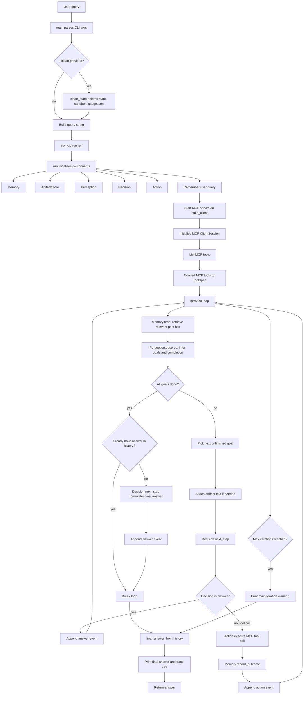
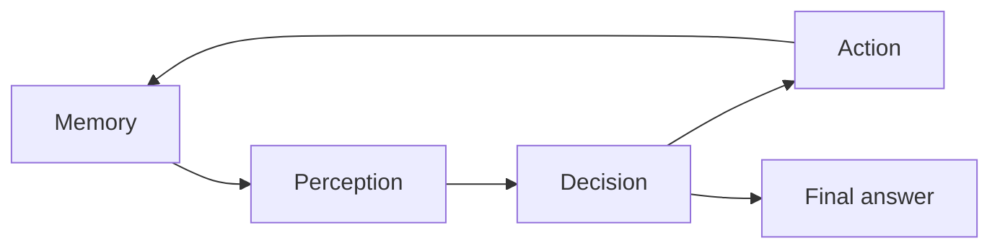
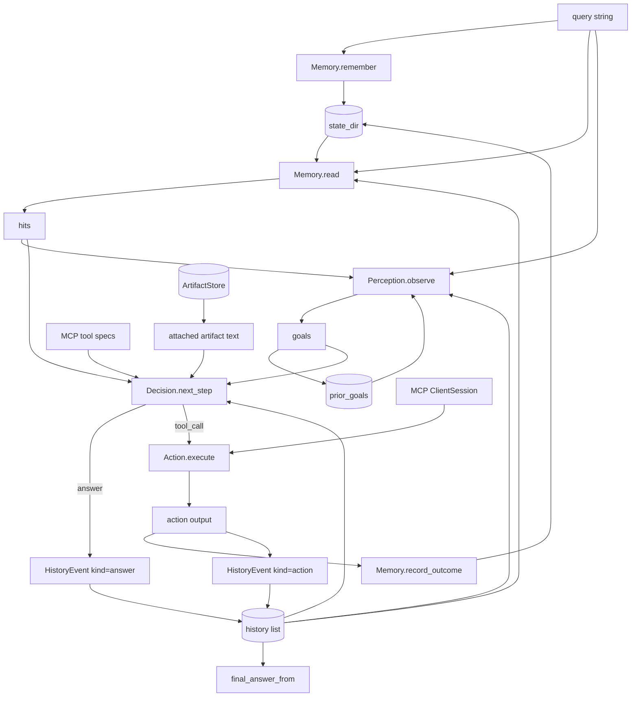
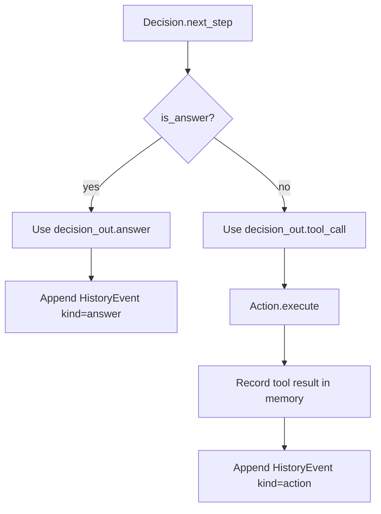
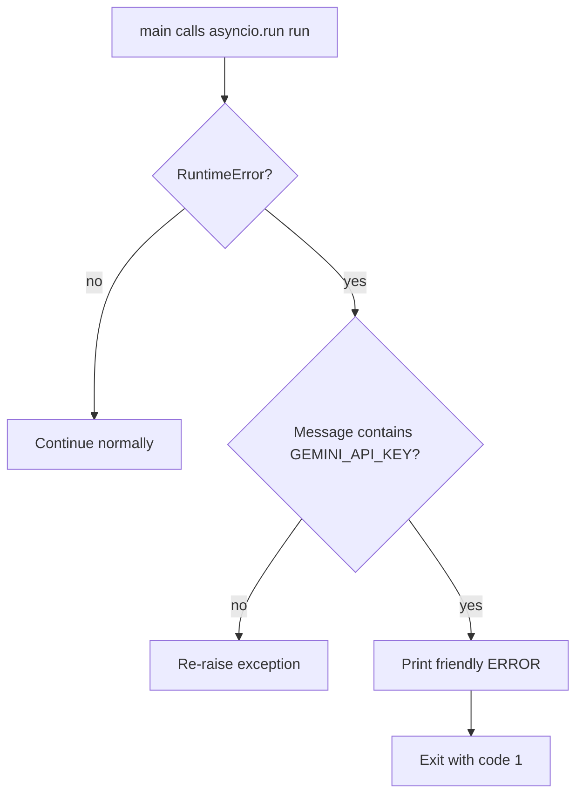

# Python agent loop walkthrough

This file is a command-line runner for an iterative agent loop. At a high level, it:

1. Takes a user query from the command line or from `run(query)`.
2. Checks that Gemini configuration is available.
3. Starts an MCP server as a subprocess over stdio.
4. Repeatedly cycles through memory, perception, decision, and action until the task is answered, all goals are complete, or the maximum iteration limit is reached.
5. Prints a rich execution trace and returns the final answer.

---

## Big-picture architecture



---

## The core loop in plain English

The most important function is `run(...)`. It performs a repeated agent cycle:



Each iteration follows this sequence:

1. **Memory**: search stored memory for relevant context.
2. **Perception**: turn the query, memory hits, history, and prior goals into an observation containing goals.
3. **Decision**: decide whether to answer now or call a tool.
4. **Action**: if a tool is chosen, execute it through the MCP session.
5. **Memory outcome**: record what happened so later iterations can use it.
6. **History**: append either an `action` event or an `answer` event.

The loop stops when:

* Perception says all goals are done.
* A final answer can be extracted from history.
* The iteration limit is reached.
* There is no unfinished goal.

---

## Important functions and what they do

### `_label(name, color, emoji="")`

Builds a Rich markup label like a colored heading with an optional emoji. This is only for nice terminal output.

### `clean_state(repo_dir)`

Deletes local runtime state:

* `state/`
* `sandbox/`
* `usage.json`

It is triggered by the CLI flag `--clean`.

### `final_answer_from(history)`

Walks backward through the history and returns the latest event whose kind is `"answer"`. If no answer was produced, it returns a fallback message.

### `tool_specs_from_mcp(list_tools_result)`

Normalizes MCP tool metadata into local `ToolSpec` objects. It handles both possible shapes:

* an object with `.tools`
* a raw iterable of tools

### `_print_trace_tree(history, total_elapsed=0.0)`

Builds a Rich tree showing each iteration, the goal, and whether the iteration ended with an action/tool call or an answer.

### `run(query, state_dir="state", max_iterations=MAX_ITERATIONS, trace=True)`

The main async orchestration function. It initializes the agent components, starts the MCP server, loops through memory/perception/decision/action, then returns the final answer.

### `main()`

The CLI entrypoint. It parses arguments, optionally cleans state, joins positional arguments into a query string, runs the async loop, and handles missing Gemini API configuration errors.

---

## Data flow diagram



---

## How the agent decides what to do next

The decision step receives:

* the original `query`
* the current unfinished `goal`
* memory `hits`
* any `attached_artifacts`
* the full `history`
* available MCP `tools`

It can return one of two things:



So `Decision` acts like the controller: it chooses whether the agent should speak or use a tool.

---

## Error and exit behavior

The CLI catches `RuntimeError` only to handle the specific case where Gemini configuration is missing:



If `--quiet` is used, the program suppresses the trace and prints only the final answer.

---

## Mental model

Think of this file as the **outer runtime shell** for an agent:

* `Memory` remembers and retrieves context.
* `Perception` turns context into goals.
* `Decision` chooses answer vs. tool call.
* `Action` executes tool calls through MCP.
* `ArtifactStore` stores and retrieves generated artifacts.
* `HistoryEvent` records what happened each iteration.
* Rich console output makes the process visible to the user.

The file itself does not contain the intelligence of the agent. It coordinates specialized modules that are imported from nearby files: `memory`, `perception`, `decision`, `action`, and `schemas`.

---

## Pseudocode summary

```python
remember(query)
start_mcp_server()
list_available_tools()

for iteration in range(max_iterations):
    hits = memory.read(query, history)
    observation = perception.observe(query, hits, history, prior_goals)

    if observation.all_done:
        if no answer yet:
            answer = decision.next_step(...)
            history.append(answer)
        break

    goal = observation.next_unfinished()
    attached_artifacts = load_artifacts_referenced_by_goal(goal)

    decision = decision.next_step(query, goal, hits, attached_artifacts, history, tools)

    if decision.is_answer:
        history.append(answer_event)
    else:
        result = action.execute(decision.tool_call)
        memory.record_outcome(result)
        history.append(action_event)

return latest_answer_from(history)
```

---

## Key thing to notice

The loop is not simply “call an LLM once.” It is an **iterative planning and tool-use loop**. Each pass can update memory and history, which changes what the next pass sees. That is why the file keeps careful records of goals, tool outputs, artifacts, timings, and trace output.
